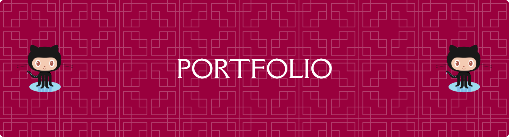

## 👋 Hi, I'm Princess Angel Calagui

Electrical Engineer • Web Developer • Automation Enthusiast

Welcome to my personal portfolio repository.

This project is a modern, interactive portfolio website built with Next.js and TypeScript, created to showcase my background as an Electrical Engineer, my technical skills, professional experience, and projects that combine engineering with technology.

## 🌐 About the Portfolio

The portfolio was designed to present my work, experience, certifications, and technical skills in a clean and interactive way.

It also demonstrates my interest in using software development and automation to create practical solutions for engineering and business workflows.

✨ Highlights 
⚡ Electrical Engineering background 
💻 Front-end and full-stack web development 
🤖 Automation and process improvement 
📊 Excel/VBA-based engineering workflows 
🎨 Modern responsive UI 
🎞️ Interactive animations 
📱 Mobile-friendly design 
🔗 GitHub and social media integration 
📄 Professional experience and certifications 
🧩 Interactive project demonstrations 

This portfolio represents my interest in combining Electrical Engineering, software development, automation, and digital tools to solve practical problems.

Rather than focusing only on traditional engineering work, I am interested in exploring how technology can improve workflows, reduce repetitive tasks, and make engineering processes more efficient.

📬 Connect With Me
GitHub: [@angelcalagui](https://github.com/angelcalagui) 
LinkedIn: [Princess Angel Calagui](https://www.linkedin.com/in/princessangelcalagui/) 
Facebook: [Princess Angel Calagui](https://www.facebook.com/princessangel.calagui/) 
Instagram: [@princessangelcalagui](https://www.instagram.com/princessangelcalagui/) 

⭐ If you find this project interesting, feel free to explore the repository and check out the live portfolio.

🌐 [Princess Angel Calagui](https://princessangelcalagui.vercel.app/)

Built with curiosity, engineering, and code. ⚡💻

##

NO RESISTANCE CAN DROP YOUR POTENTIAL​

